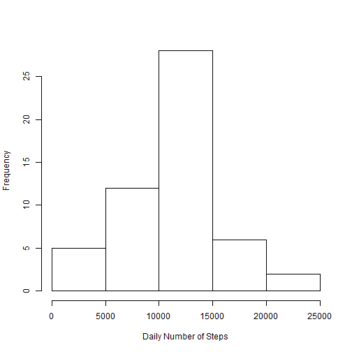
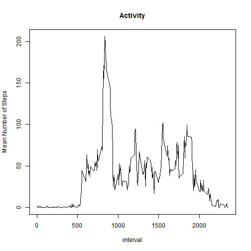
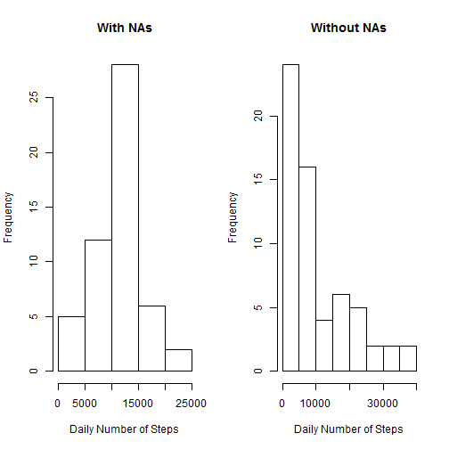
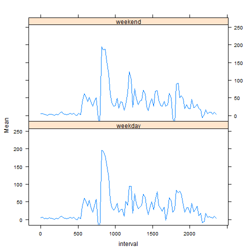

# Project 1
## Reproducible Research
### By Arturo Silva

## Introduction

We analyse data from a personal activity monitoring device.  This device collects data at 5 minute intervals through out the day. The data consists of two months of data from an anonymous individual collected during the months of October and November, 2012 and include the number of steps taken in 5 minute intervals each day.

## Loading and preprocessing the data

The code needed to upload the data to R is:


```r
activity <- read.csv("activity.csv")
```

We transform/process the data in order to read the dates with the code:


```r
activity$date <- as.Date(activity$date, format = "%Y-%m-%d")
```

## What is the mean total number of steps taken per day?

1. Calculate the total number of steps taken per day.


```r
suppressPackageStartupMessages(library(dplyr))
steps <- group_by(activity, date)
steps1 <- summarise(steps, NumSteps = sum(steps))
```

2. Make a histogram of the total number of steps taken each day.


```r
hist(steps1$NumSteps, xlab = "Daily Number of Steps", main = "")
```



3. Calculate and report the mean and the median of the total number of steps taken per day.


```r
options(scipen=999)
meanSteps1 <- round(mean(steps1$NumSteps, na.rm = TRUE), digits = 0)
medianSteps1 <- median(steps1$NumSteps, na.rm = TRUE)
```

The mean of the total number of steps taken per day is 10766, and the median is 10765.

## What is the average daily activity pattern?

1. Make a time series plot of the 5-minute interval (x-axis) and the average number of steps taken, averaged across all days (y-axis).


```r
steps2 <- group_by(activity, interval)
steps3 <- summarise(steps2, Mean = mean(steps, na.rm = TRUE))
plot(steps3, type = "l", ylab = "Mean Number of Steps", main = "Activity")
```



2. Which 5-minute interval, on average across all the days in the dataset, contains the maximum number of steps?


```r
maxInterval <- steps3$interval[which(steps3$Mean == max(steps3$Mean))]
```

The 5-minute interval that contains the maximum number of steps is interval number 835.

## Inputing missing values

1. Calculate and report the total number of missing values in the dataset (i.e. the total number of rows with NAs).


```r
totalNA <- nrow(activity) - sum(complete.cases(activity))
```

  The total number of missing values is 2304.
  
2. Devise a strategy for filling in all of the missing values in the dataset. The strategy does not need to be sophisticated. For example, you could use the mean/median for that day, or the mean for that 5-minute interval, etc.
Create a new dataset that is equal to the original dataset but with the missing data filled in.


```r
activity2 <- NULL
a <- nrow(activity) / length(unique(activity$interval))
b <- length(unique(activity$interval))
for(i in 1:a){
for(j in 1:b){
if(is.na(activity$steps[i * j])){
activity2 <- rbind(activity2, data.frame(steps = steps3$Mean[j], date = activity$date[i * j], interval = activity$interval[i * j]))
}
else{
activity2 <- rbind(activity2, data.frame(steps = activity$steps[i * j], date = activity$date[i * j], interval = activity$interval[i * j]))
}
}
}
```
3. Make a histogram of the total number of steps taken each day and calculate and report the *mean* and *median* total number of steps taken per day. Do these values differ from the estimates from the first part of the assignment? What is the impact of imputing missing data on the estimates of the total daily number of steps?

We can show both histograms to show the difference between the one with the missing values and the one with missing values filled out:


```r
steps4 <- group_by(activity2, date)
steps5 <- summarise(steps4, NumSteps = sum(steps))
par(mfrow = c(1, 2))
hist(steps1$NumSteps, xlab = "Daily Number of Steps", main = "With NAs")
hist(steps5$NumSteps, xlab = "Daily Number of Steps", main = "Without NAs")
```


To calculate the *mean* and *median* of this new dataset we use the following code:


```r
meanSteps2 <- round(mean(steps5$NumSteps), digits = 0)
medianSteps2 <- round(median(steps5$NumSteps), digits = 0)
```
So that the new *mean* is 10237, while the new *median* is 6971.  So we see there is a dramatic change.

## Are there differences in activity patterns between weekdays and weekends?

1. Create a new factor variable in the dataset with two levels - "weekday" and "weekend" indicating whether a given date is a weekday or weekend day.


```r
activity3 <- mutate(activity2, Weekday = ifelse(weekdays(activity2$date) == "sábado" | weekdays(activity2$date) == "domingo", "weekend", "weekday"))
```
2. Make a panel plot containing a time series plot (i.e. type = "l") of the 5-minute interval (x-axis) and the average number of steps taken, averaged across all weekday days or weekend days (y-axis).


```r
library(lattice)
steps6 <- group_by(activity3, interval)
steps7 <- mutate(steps6, Mean = mean(steps))
xyplot(Mean ~ interval| factor(Weekday), data = steps7, type = 'spline', layout = c(1, 2))
```


